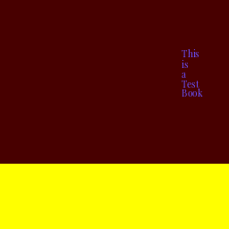

# Aim

In this project, I wanted to look at the degree to which books are judged by their covers
and try to generate high-rated books from a model trained to predict

# Description

For this project I used a small existing dataset (~30000 examples) of book covers and
their respective ratings and trained an existing architecture to classify those images.
For generation I used a simple simulated annealing-like method that generates and mutates
images using a simple indirect encoding and tries to find the one that maximises the network's
estimated rating.

# Results and conclusion

Despite the model training to achieve 76% validation accuracy, it didn't seem to learn
useful features and the covers it generates are pretty unsightly. I think the reason
for that was the small size of the dataset (no data augmentation was used) and the novelty
of the domain of generated images. Another reason might be that there's an adversarial example-like
effect here: the samples being selected are the ones that exploit the network's inherent
weaknesses that came from hidden patterns in the dataset. Data augmentation might also help with this.

In my next project I will try to incorporate more data augmentation to improve the
stability of the network.

# Credits

This projects uses the [book covers dataset](https://www.kaggle.com/lukaanicin/book-covers-dataset)
by lukaanicin and MobileNet by Google.
